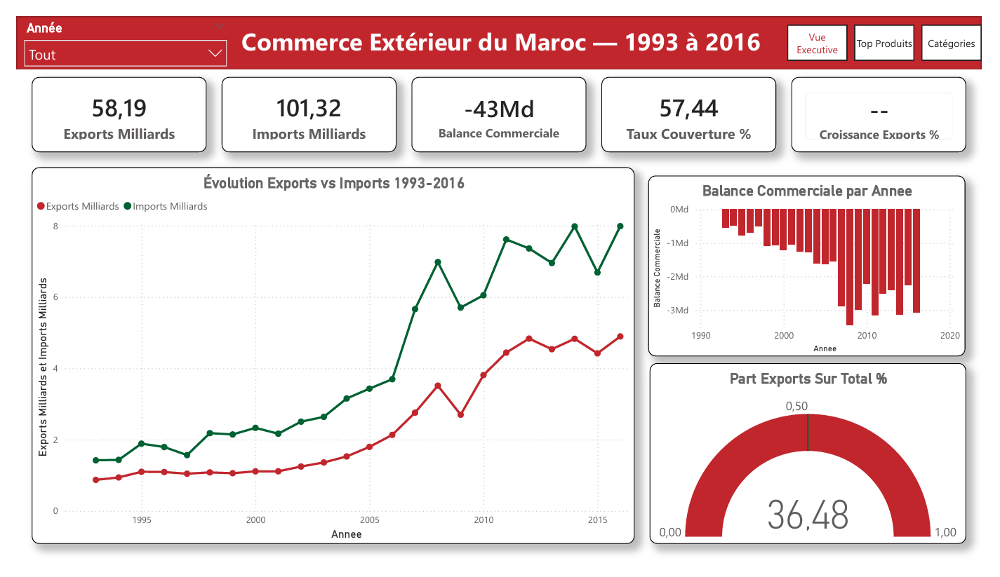
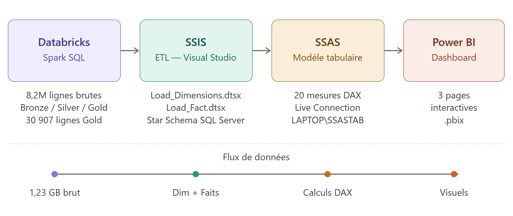
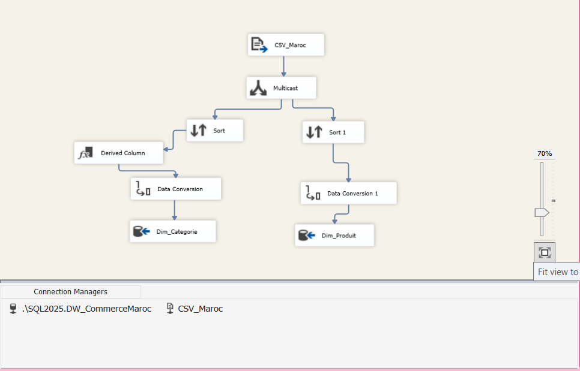
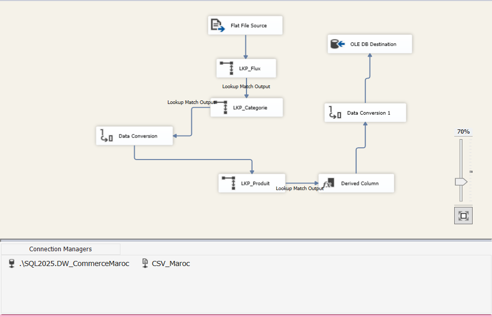
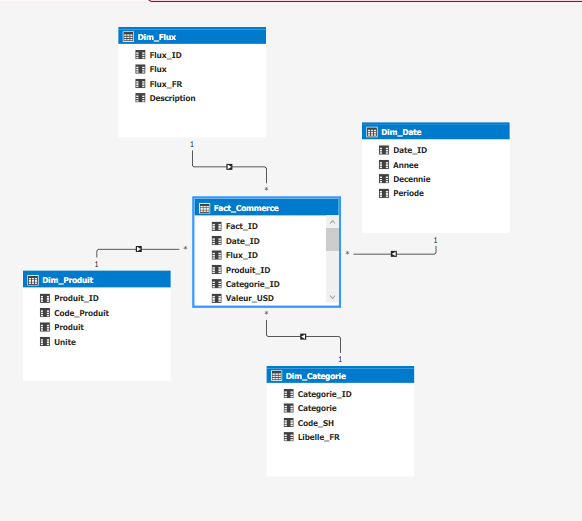
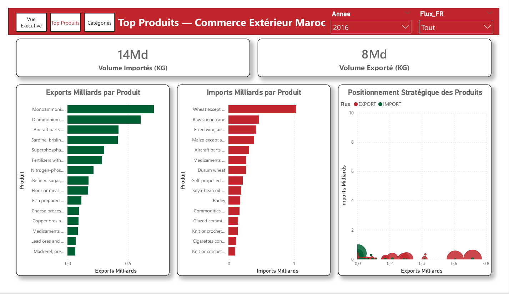
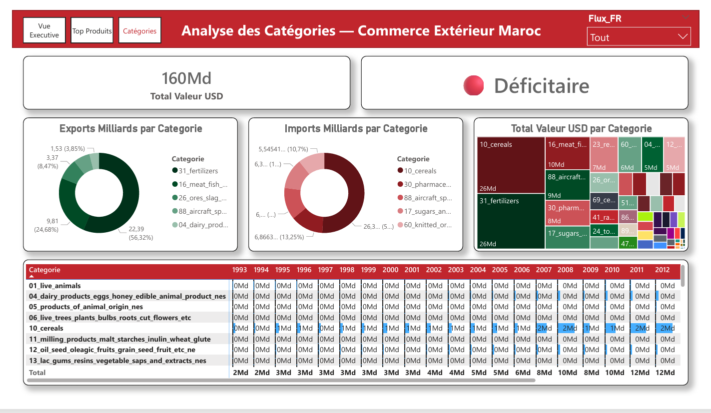

# 📊 Moroccan Foreign Trade Data Engineering Pipeline (1993 - 2016)



## 📖 Overview
This project focuses on building an end-to-end Data Engineering and Business Intelligence pipeline to analyze Morocco's external commerce over 24 years (1993 to 2016). The project encompasses data ingestion, cleaning, transformation, modeling, and visualization, transitioning data from a raw state into actionable insights via a Power BI Dashboard.

## 🏗️ Architecture



The complete data stack involves the following tools:
1. **Databricks (Spark SQL)**: Processing **8.2 Million raw rows**, going through **Bronze -> Silver -> Gold** layers to finally extract a refined **30,907 rows** Gold dataset.
2. **SSIS (Visual Studio)**: The ETL pipeline mapping the refined data into a Star Schema. 
3. **SSAS (Tabular Model)**: Creating the semantic layer with **20 DAX measures** over the loaded schema.
4. **Power BI**: Connecting Live to the Tabular Model to build an interactive dashboard with 3 main pages.

---

## ⚙️ Data Pipeline Details

### 1. Data Processing with Databricks
The raw dataset, accessed from the [UN Global Commodity Trade Statistics on Kaggle](https://www.kaggle.com/datasets/unitednations/global-commodity-trade-statistics), spans multiple gigabytes (**1.23 GB brut**). Using Spark SQL and the Medallion Architecture:
- **Bronze Layer**: Raw ingestion of global trade records.
- **Silver Layer**: Data cleaning, handling missing values, standardizing formats, and filtering for Morocco's data.
- **Gold Layer**: Aggregated and ready-to-load business-level data.

### 2. ETL with SSIS
The Extract, Transform, and Load (ETL) process is automated using SQL Server Integration Services (SSIS). 
- `Load_Dimensions.dtsx`: Populating dimension tables such as `Dim_Categorie` and `Dim_Produit` using Lookups (`LKP_Categorie`, `LKP_Produit`) and Data Conversions.


- `Load_Fact.dtsx`: Transforming and loading the bulk trade transactions into the `Fact_Commerce` table by looking up the correct foreign keys from the dimension tables.


### 3. Star Schema Design
The Data Warehouse was built in **SQL Server** using a Kimball methodology Star Schema. It provides optimal query performance for analytical reporting.



**Tables:**
- **Fact_Commerce**: Central table containing measures (`Valeur_USD`) linked by foreign keys to dimensions.
- **Dim_Produit**: Details about the traded products (Code_Produit, Produit, Unite).
- **Dim_Flux**: Trade flows (Import/Export).
- **Dim_Date**: Temporal dimension (Année, Décennie, Période).
- **Dim_Categorie**: Product categorization (Code_SH, Libellé).

### 4. Semantic Layer with SSAS
An SSAS Tabular Model builds on top of the Star Schema.
- Contains complex DAX calculations such as Trade Balance (Balance Commerciale), Coverage Rate (Taux Couverture), and Export Growth (Croissance Exports).
- Provides a fast, centralized Truth for Power BI via Live Connection.

### 5. Data Visualization with Power BI
The final interactive dashboard highlights key economic indicators over the 24-year period across **3 main pages**:

**1. Vue Executive (Global KPIs & Trends):**
- **KPIs**: 58.19 Billion Exports vs 101.32 Billion Imports, resulting in a Trade Deficit of ~43 Billion.
- **Trend Analysis**: Yearly evolution of Imports vs. Exports (1993-2016).
- **Composition**: Export portions over the total.

**2. Top Produits (Product-Level Analysis):**
- Identifies the highest volume products (14 Billion KG Imported vs 8 Billion KG Exported).
- Displays horizontal bar charts for "Exports Milliards par Produit" and "Imports Milliards par Produit" (e.g., Monoammonium phosphate, Wheat, Raw sugar).
- Strategic positioning scatterplot comparing Export/Import volume.


**3. Analyse des Catégories (Sectoral Breakdown):**
- Overview of Category totals (160 Billion Total Value USD, identified as "Déficitaire").
- Provides Donut charts for Export/Import distribution by category (Fertilizers taking the lead in exports at 56.32%).
- Treemap and matrix views mapping categories per year (e.g., Cereals, Live Animals, Dairy).


## 📂 Project Structure
```text
📦 Projet Commerce Maroc
 ┣ 📂 All Documents            # Documentations (Guides, Analyses, Notes DAX)
 ┣ 📂 Bigdata-Databricks       # Notebooks Jupyter/Databricks pour le traitement de la donnée
 ┣ 📂 Dashboard Power Bi       # Livrables PDF du Dashboard PBI
 ┣ 📂 images                   # Captures d'écran et schémas d'architecture métier 
 ┣ 📜 Readme First.pdf         # Introduction principale du projet
 ┗ 📜 README.md                # Ce fichier de documentation
```

> **Note**: For size constraints and security, the `SSIS-SSAS-SSMS Ressources` source files, `.pbix` dashboards, and raw `DataSet/` folder are ignored in this repository.

## 🚀 How to Replicate
1. Ensure you have SQL Server, SSIS, and SSAS installed and running.
2. Run the `Pipeline_Commerce_Maroc.ipynb` script locally or on Databricks to generate the Gold dataset.
3. Use the generated `trade_stat_Maroc.csv` and feed it into the SSIS package (Configure your local DB connection strings).
4. Process the Tabular Model in SSAS.
5. Connect Power BI Desktop to the local Tabular instance and recreate or refresh the visuals.
